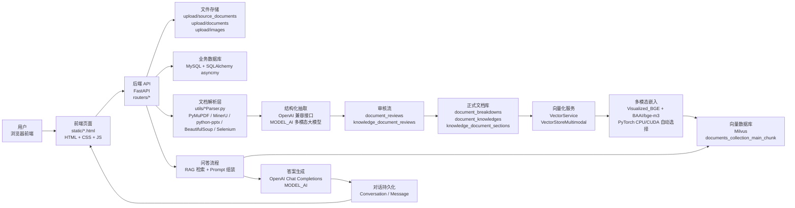
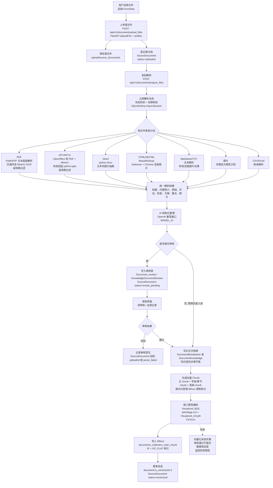
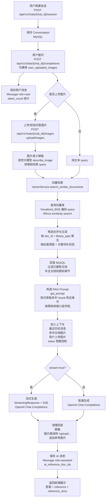

# 系统文件处理与问答回复流程图

本文档用于说明当前系统从文件上传、解析、审核、向量化，到用户提问、检索、生成回复的完整工作流程，并标注每一步涉及的主要技术与代码模块。

## 总览图

## 文件处理流程

## 问答回复流程

## 关键技术点

| 模块 | 当前实现 | 主要技术 |
| --- | --- | --- |
| 前端交互 | 文件上传、解析、审核、问答页面 | HTML、CSS、JavaScript、FormData、SSE |
| 后端 API | 路由与鉴权入口 | FastAPI、Depends、JWT、Pydantic |
| 业务数据库 | 用户、源文件、审核、文档、消息 | MySQL、SQLAlchemy AsyncSession、asyncmy |
| 文件存储 | 源文件、解析图片、问答图片 | 本地 upload 目录、FastAPI 静态资源挂载 |
| PDF 解析 | 普通 PDF 和扫描 PDF | PyMuPDF、MinerU OCR、图片过滤 |
| PPT 解析 | PPT 优先转 PDF 后解析 | LibreOffice/soffice、MinerU、python-pptx |
| HTML 解析 | 文本与图片提取 | BeautifulSoup、Selenium、ChromeDriver |
| AI 结构化 | 把非结构化文件整理成文档字段 | OpenAI 兼容接口、MODEL_AI 多模态模型 |
| 审核流 | 新增、修改、删除审核 | document_reviews、knowledge_document_reviews、事务回滚 |
| 向量化 | 文档拆 chunk 并嵌入 | Visualized_BGE、BAAI/bge-m3、PyTorch |
| 向量库 | 存储与检索文档 chunk | Milvus、pymilvus、IP、IVF_FLAT |
| RAG 回复 | 检索证据并生成回答 | VectorService、Prompt 组装、Chat Completions、流式 SSE |

## 重要业务约束

- 源文件上传只保存文件和 SourceDocument 记录，不直接入库。
- 技术人员解析后默认提交审核，审核通过后才写正式文档库。
- 审核通过时如果向量化失败，业务表和审核状态不提交，文档保持待处理状态，前端展示失败原因。
- 文档表和 Milvus 向量库要求一对一一致，`is_vectorized=1` 表示正式文档已完成向量写入。
- 问答只基于检索到的知识文档构造 prompt，参考图片由后端统一转成 `/upload/...` URL 后展示。
